# DFM Signage – Anwenderhandbuch

*Für alle, die Bildschirme im Museum bespielen – ohne Technikkenntnisse.*
Alles in diesem System läuft **ohne Internet** im Museumsnetz.

**Der kurze Weg:** SD-Karte flashen → Pi einstecken → QR-Code scannen → fertig.

---

## 1. SD-Karte vorbereiten (flashen)

Du brauchst: einen Computer, eine SD-Karte (mindestens 16 GB), die Datei `dfm-signage-arm64-<version>.img.xz` und das kostenlose Programm *Raspberry Pi Imager* (oder *balenaEtcher*).

1. Programm öffnen. 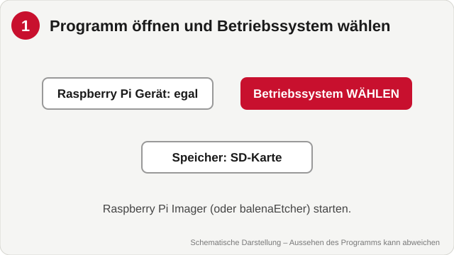
2. Bei „Betriebssystem“ **„Eigenes Image verwenden“** wählen und die Datei `dfm-signage-arm64-….img.xz` auswählen. 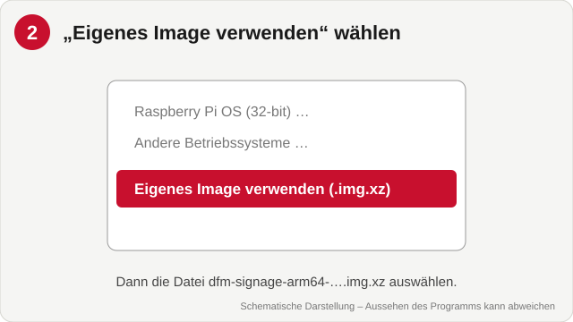
3. Wenn gefragt wird, ob Einstellungen angepasst werden sollen: **Nein.** Das Image braucht nichts vorab (kein WLAN, keinen Benutzer). 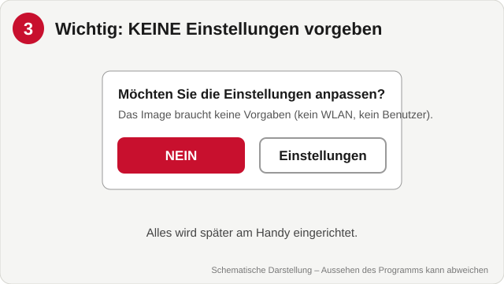
4. Schreiben lassen, am Ende die Karte entnehmen. 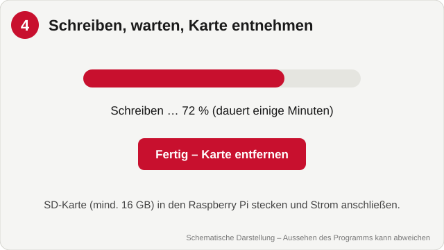

> Du kannst vorher die Echtheit prüfen: Zum Image gehören eine Prüfsumme (`.sha256`) und eine Signatur (`.sig`). Das Skript `build/verify-release.sh` zeigt „Signatur gültig“ (siehe Technikhandbuch).

## 2. Pi einstecken und mit dem Handy einrichten

Stecke die Karte in den Raspberry Pi, schließe einen Bildschirm per HDMI an und dann den Strom. Es erscheint zuerst das DFM-Logo mit „Willkommen“ – **nie** ein schwarzer Bildschirm oder Text.

### Schritt 1 – Handy verbinden
Der Bildschirm zeigt einen QR-Code, ein Netzwerk (`DFM-Setup-…`) und ein Passwort.

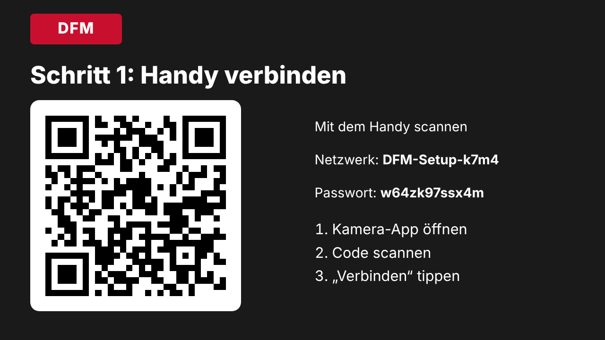

1. Kamera-App am Handy öffnen. 2. Code scannen. 3. „Verbinden“ tippen.

### Schritt 2 – Einrichtung öffnen
Sobald das Handy verbunden ist, wechselt der Bildschirm. Meist öffnet sich die Einrichtungsseite **von selbst**. Wenn nicht: den zweiten QR-Code scannen oder `http://10.42.0.1/` im Browser öffnen. Gib die **6-stellige PIN** vom Bildschirm ein.

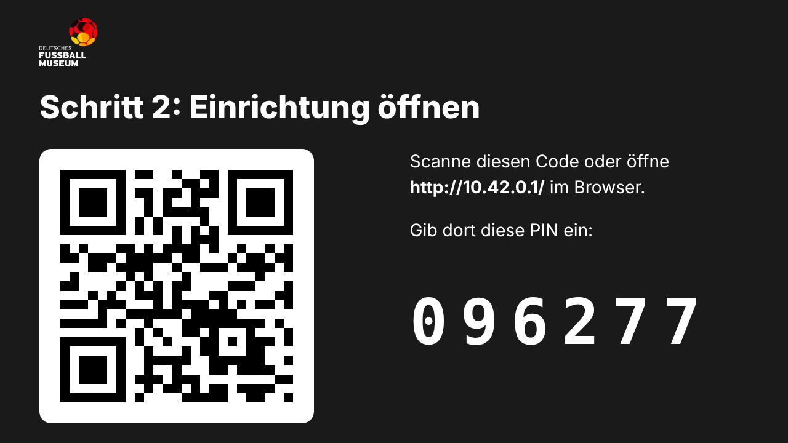
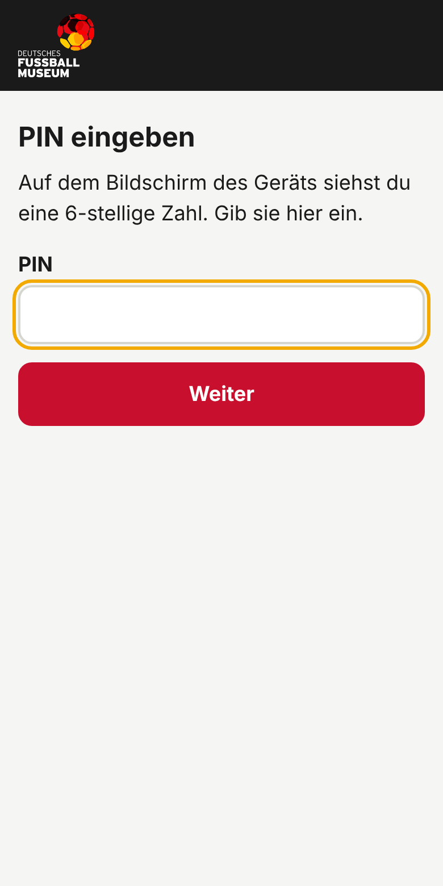

### Die vier Schritte am Handy
1. **WLAN wählen** – Netzwerk antippen, Passwort eingeben (mit dem Auge-Symbol kannst du es anzeigen). *Hinweis:* Raspberry Pi 3 B (ohne Plus) und Zero 2 W können nur 2,4-GHz-WLAN. Das Gerät prüft das WLAN; dabei verliert dein Handy **kurz** die Verbindung – das ist normal und es verbindet sich von selbst wieder. Bei falschem Passwort steht dort „Das Passwort scheint falsch zu sein“, und du kannst es noch einmal versuchen.
   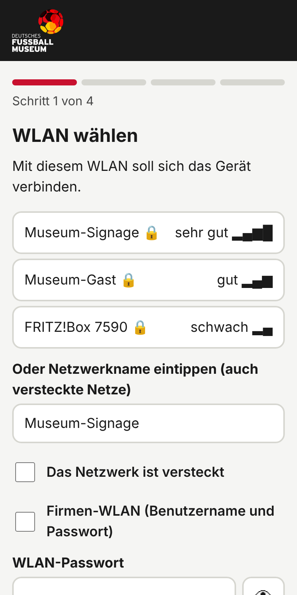
2. **Was ist dieses Gerät?** – „Hauptbildschirm-Rechner (Hub)“ gibt es **nur einmal** im Museum, er speichert alles. Alle anderen sind „Bildschirm (Player)“.
   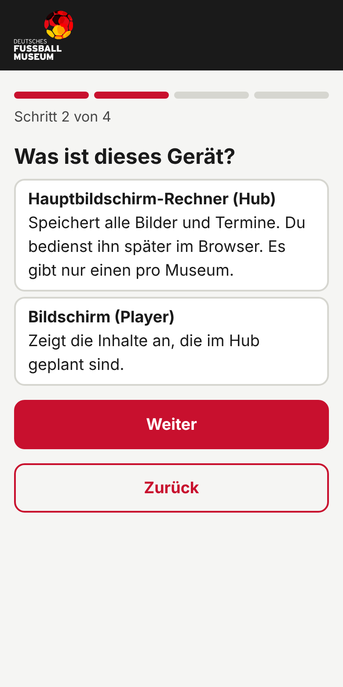
3. **Angaben** – Für den Hub: dein Name, ein langes Passwort (mindestens 12 Zeichen) und der Name des Museums. Für einen Bildschirm: ein Name (z. B. „Shop-Screen“), die Adresse des Hubs und der **Einrichtungscode** aus dem Hub.
   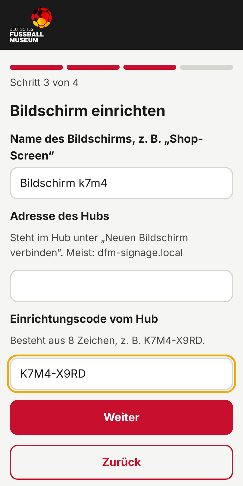
4. **Fertig** – Das Gerät startet neu. Du kannst das Setup-WLAN verlassen. Der Hotspot ist danach aus.

**Der Einrichtungsmodus endet von selbst:** nach 15 Minuten ohne Eingabe (neuer Start mit neuem Passwort und neuer PIN) und sofort nach erfolgreicher Einrichtung.

### Weitere Wege (wenn du lieber ohne Handy einrichtest)
| Weg | So geht’s |
|---|---|
| **Datei auf der SD-Karte** | Auf der Karte liegt `dfm-setup.vorlage.txt`. Umbenennen in `dfm-setup.txt`, ausfüllen, speichern. Beim Start wird sie gelesen und **gelöscht** (sie enthält Passwörter). So bereitest du viele Bildschirme auf einmal vor. |
| **Startkarte aus dem Hub** | Im Hub „Neuen Bildschirm verbinden“ → „Startkarte“. Am Handy scannen füllt WLAN, Hub und Code automatisch aus. |
| **Netzwerkkabel** | Steckt beim ersten Start ein Kabel, geht die Einrichtung auch ohne WLAN. |
| **Kamera am Pi** | Ist eine Kamera angeschlossen, kann der Pi einen WLAN-QR-Code vom Handy scannen. |
| **Ohne Bildschirm (Hub)** | Das Gerät nutzt Datei oder Kabel. Die PIN steht in `geraeteinfo.txt` (letzte 6 Zeichen der Seriennummer, aufs Gerät kleben). |

## 3. Den Hub im Browser öffnen

Öffne `https://dfm-signage.local` (oder die IP-Adresse, die dir die IT nennt).

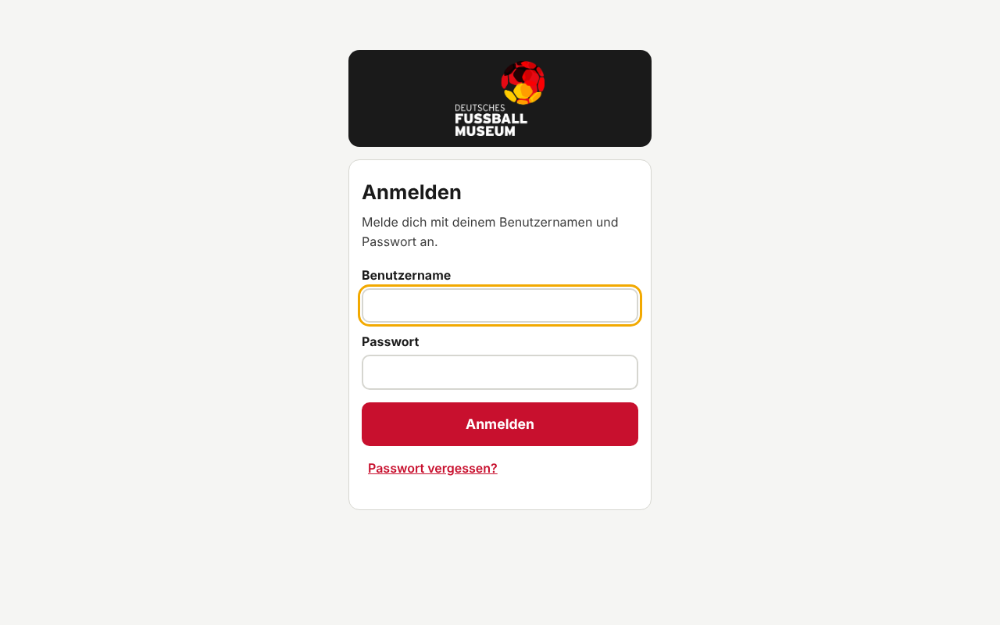

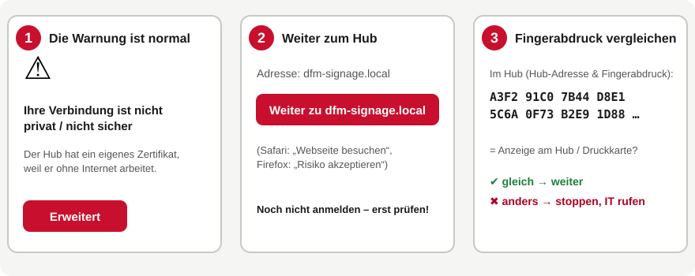

**Der Browser zeigt eine Warnung – das ist normal.** Der Hub arbeitet ohne Internet und hat darum ein eigenes Sicherheitszertifikat. So gehst du sicher vor:
1. Auf der Warnseite „Erweitert“ → „Weiter zu dfm-signage.local“.
2. Vergleiche den **Fingerabdruck** (Hub-Seite: *Bildschirme → Hub-Adresse & Fingerabdruck*) mit dem Aufdruck oder der Anzeige am Hub. Stimmen alle Zeichen überein, bist du richtig. Stimmen sie nicht überein: **nicht fortfahren, IT informieren.**

Beim ersten Mal führt dich ein Assistent: Konto → Sicherheit prüfen → ersten Bildschirm verbinden → erstes Bild hochladen → ersten Termin anlegen.

## 4. Die Startseite

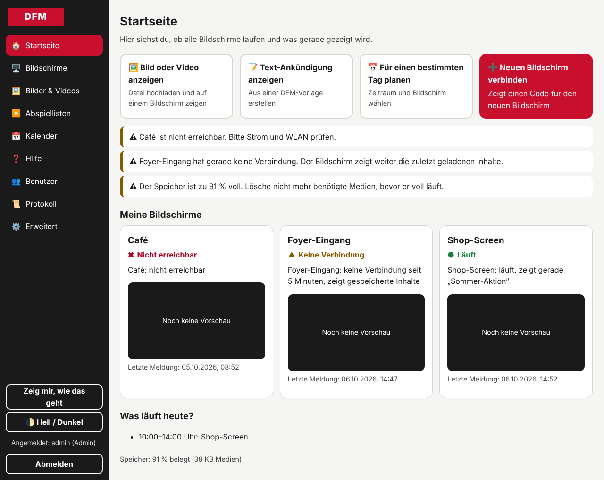

Hier siehst du auf einen Blick:
- **Schnellstart-Karten:** Bild/Video zeigen, Text-Ankündigung, Tag planen, Bildschirm verbinden.
- **Hinweise** in Klartext, z. B. „Foyer hat gerade keine Verbindung. Der Bildschirm zeigt weiter die zuletzt geladenen Inhalte.“
- **Jeder Bildschirm** mit Status (Symbol **und** Text – nicht nur Farbe): *Läuft*, *Keine Verbindung*, *Nicht erreichbar*, dazu ein Satz („Shop-Screen: läuft, zeigt gerade ‚Sommer-Aktion‘“) und eine Vorschau.
- **Was läuft heute?**

## 5. Neuen Bildschirm verbinden

1. Schalte den neuen Bildschirm ein.
2. Klicke im Hub auf **„Neuen Bildschirm verbinden“**. Du bekommst einen **Code** (10 Minuten gültig, einmal nutzbar) und den **Fingerabdruck** des Hubs.
   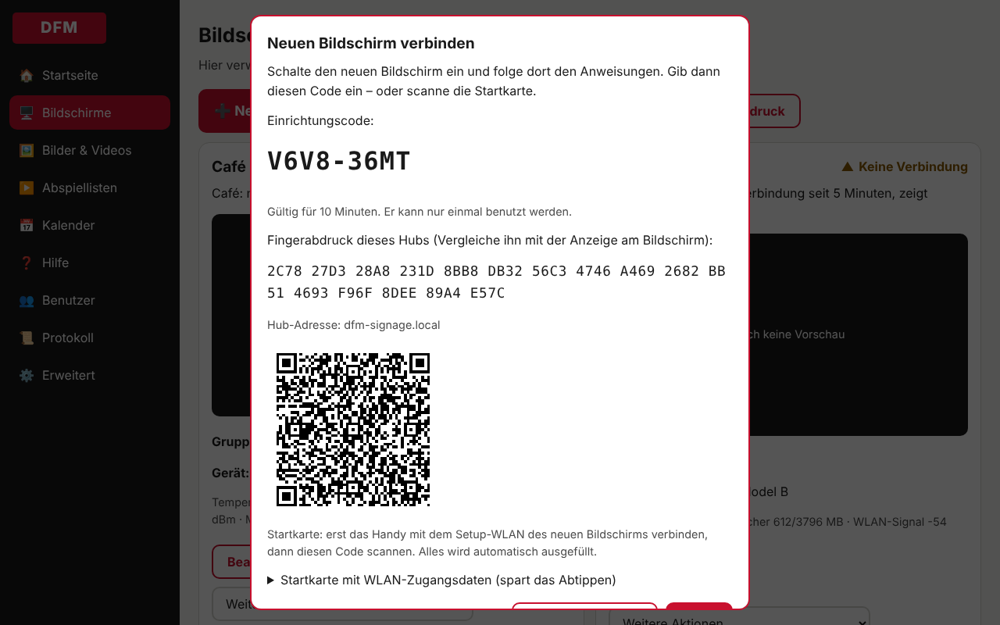
3. Gib den Code am Handy ein (oder nutze die Startkarte).
4. Im Hub erscheint „**Ist das dein Bildschirm?** Modell …, Name …“ – klicke **„Ja, das ist mein Bildschirm“**.

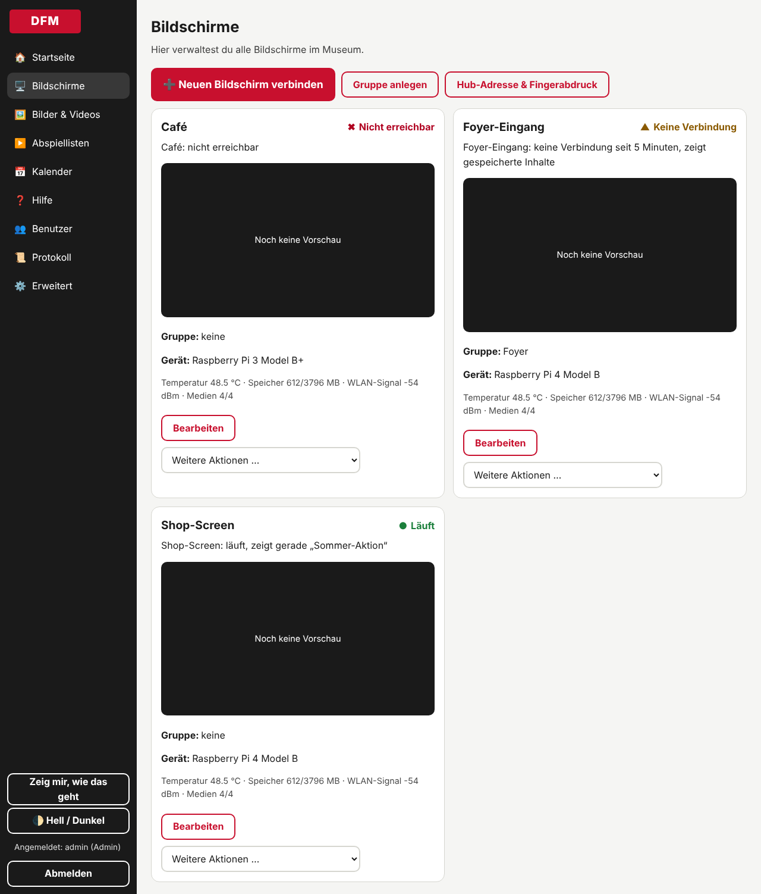

Mit „Weitere Aktionen“ kannst du einen Bildschirm neu laden, neu starten, drehen (0°/90°/180°/270°), das WLAN ändern, eine Diagnose starten, sperren, entfernen oder auf Werkseinstellungen zurücksetzen. Jede riskante Aktion fragt vorher nach.

## 6. Bilder, Videos und Texte hochladen

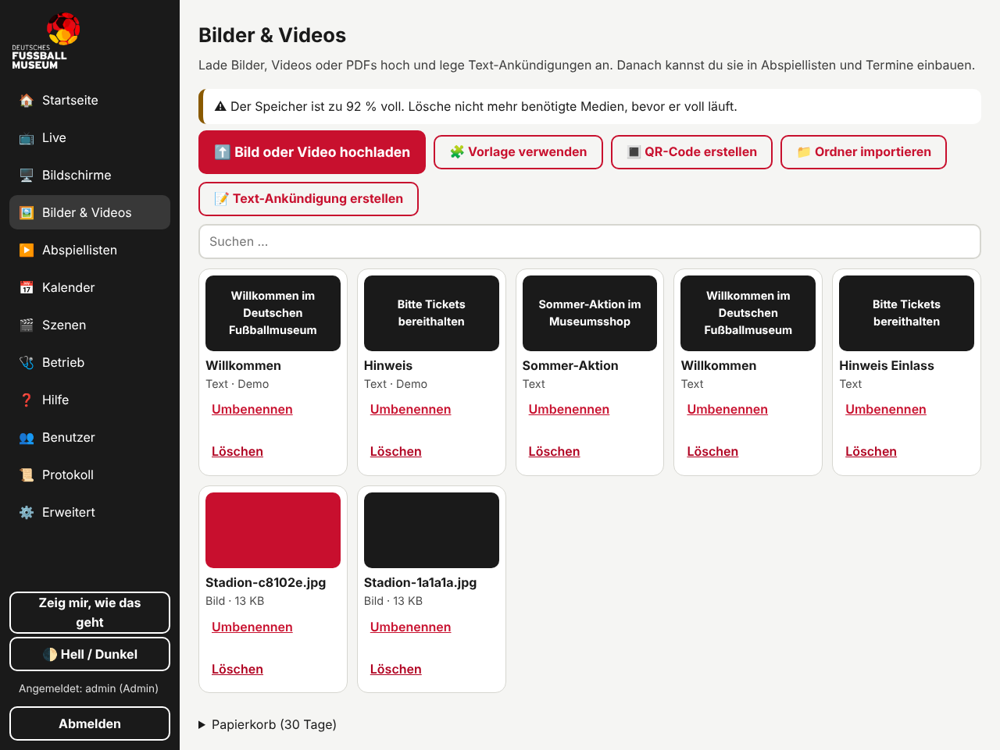

- **Bilder** (JPG, PNG, WebP), **Videos** (MP4, MOV, MKV) und **PDF** (jede Seite wird ein Bild). Du kannst Dateien auch hineinziehen.
- Der Hub bereitet jede Datei **automatisch** für jeden Bildschirmtyp vor („Wird für die Bildschirme vorbereitet …“). Bei langen Videos kann das einige Minuten dauern.
- Er sagt dir, wenn etwas nicht optimal ist („Das Bild ist ziemlich klein …“).
- **Text-Ankündigung:** Überschrift, Text, eine von drei DFM-Vorlagen – mit Vorschau.
  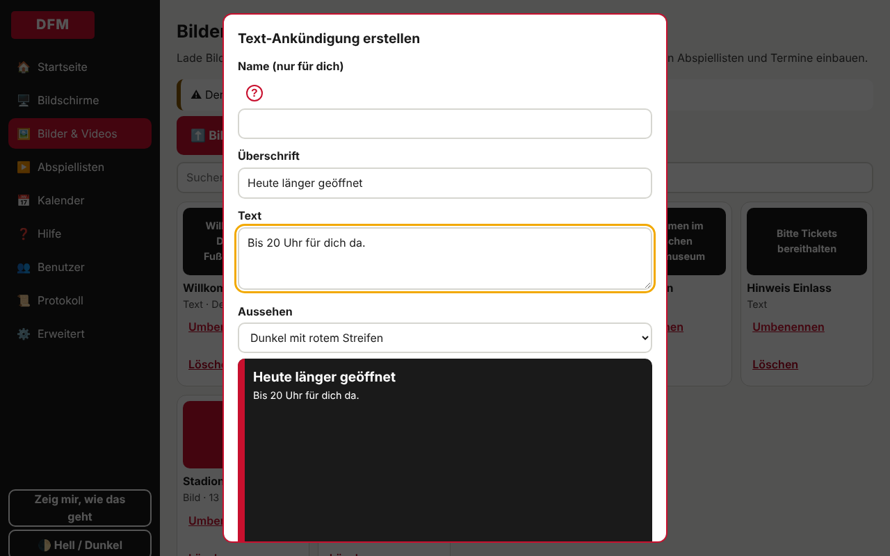
- **Löschen** schiebt in den **Papierkorb** (30 Tage), von dort kannst du wiederherstellen.

## 7. Abspiellisten

Eine Abspielliste ist eine Reihenfolge von Bildern, Videos und Texten – jeweils mit Dauer und Übergang (Überblenden oder harter Schnitt). Reihenfolge per Ziehen oder Pfeilen ändern. Die als **Standard** markierte Liste läuft, wenn kein Termin etwas anderes festlegt.

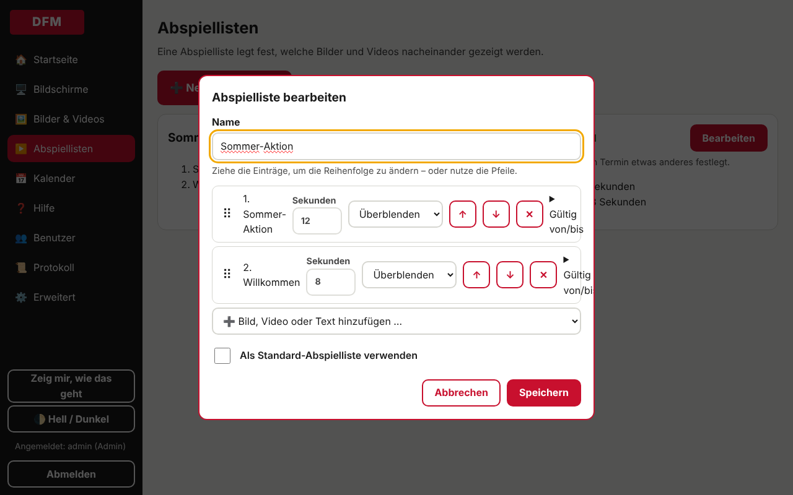

## 8. Termine planen

Im **Kalender** (Tag / Woche / Monat) klickst du ein Feld an oder ziehst über einen Zeitraum. Dann beschreibst du den Termin in einem Satz:

> **Zeige** *[Sommer-Aktion]* **auf** *[Shop-Screen]* **am** *[Dienstag, 13.10.]* **von** *[10:00]* **bis** *[12:00]* **Uhr.**

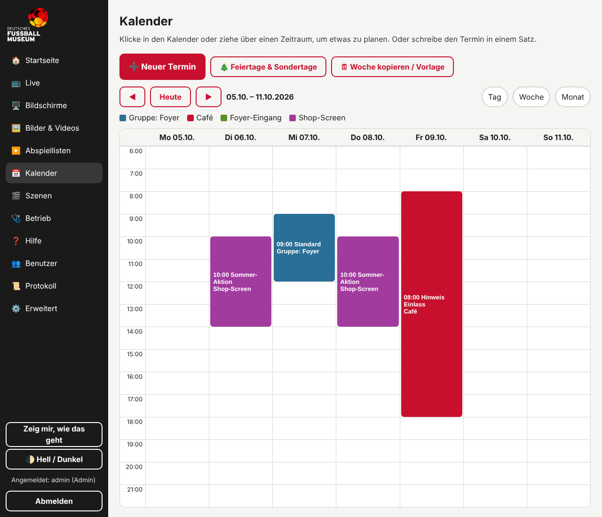

- **Wiederholung** in Alltagssprache: einmalig, jeden Tag, jede Woche (Wochentage wählen), jeden Monat – optional „bis …“.
- **Einen Tag ausfallen lassen:** Termin anklicken → „Nur diesen Tag ausfallen lassen“.
- **Vorschau:** „So sieht der Bildschirm am Dienstag um 10:00 Uhr aus.“
- **Überschneiden sich zwei Termine?** Du bekommst eine Erklärung und einen Vorschlag: Es gewinnt ① der Termin direkt für den Bildschirm (vor Gruppen-Terminen), ② der wichtigere (Wichtigkeit 1–10 unter „Erweitert“), ③ bei Gleichstand der später gestartete. Gibt es keinen Termin, läuft die Standard-Abspielliste, sonst das DFM-Standby-Bild.
- Jeder Bildschirm hat im Kalender seine **Farbe** (Legende oben).

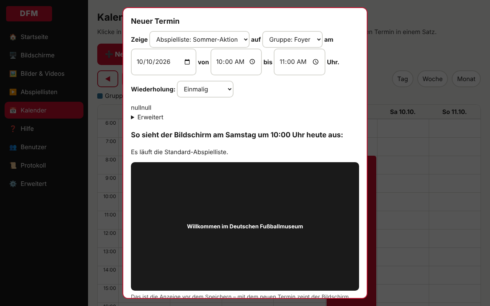

**Zeitumstellung:** Termine gelten immer in deutscher Zeit (Europe/Berlin). Ein Termin um 02:30 am Umstellungstag im März (die Uhrzeit gibt es dann nicht) startet um 03:30, im Oktober beim ersten Mal 02:30.

## 9. Was passiert, wenn …?

| Situation | Was der Besucher sieht | Was du siehst |
|---|---|---|
| WLAN fällt aus | Alles läuft weiter (gespeicherte Inhalte), **keine** Fehlermeldung | Startseite: „Keine Verbindung“ |
| Der Hub ist aus | Termine laufen weiter (die nächsten 14 Tage sind auf dem Bildschirm gespeichert) | – |
| Strom weg | Nach dem Start läuft alles wieder von selbst | Kurz „Keine Verbindung“ |
| Das WLAN-Passwort wurde geändert | Weiter gespeicherte Inhalte. Nach 10 Minuten startet der Einrichtungsmodus (Hotspot) | Bildschirm → Weitere Aktionen → WLAN ändern, oder neu einrichten |
| Die Uhr des Hubs geht falsch | – | Startseite: „Die Uhr des Hubs geht falsch“ → „Uhr mit diesem Computer abgleichen“ |
| Ein Video ist zu schwer für einen schwachen Bildschirm | Das Element wird übersprungen | Hinweis in der Oberfläche |

## 10. WLAN ändern, Gerät zurücksetzen
- **Im Hub:** Bildschirme → *Weitere Aktionen* → **WLAN ändern**. Das neue WLAN wird erst übernommen, wenn die Verbindung getestet wurde. Klappt es nicht, bleibt der Bildschirm im alten WLAN, und du bekommst einen Hinweis in „Betrieb“.
- **Am Gerät ohne Tastatur:** Lege auf der SD-Karte eine **leere Datei `dfm-reset-wifi`** ab *oder* schalte das Gerät **5× kurz hintereinander aus und wieder ein** (jeweils bevor der Bildschirm 2 Minuten lief) *oder* einen **Taster am GPIO 3 für 3 Sekunden** halten. Alle drei Wege starten nur den Einrichtungsmodus und löschen keine Inhalte. Danach startet der Einrichtungsmodus „Nur WLAN ändern“ – Rolle und Daten bleiben erhalten.
- **Werksreset:** Bildschirme → *Auf Werkseinstellungen zurücksetzen* (löscht alle Daten des Geräts, danach muss es neu eingerichtet werden).

## 11. Hilfe in der Oberfläche
Überall gibt es **(?)-Hilfen**, die **Anleitung** (Menü ❓ Hilfe, Kapitel 53) und den Rundgang **„Zeig mir, wie das geht“** (alles ohne Internet).

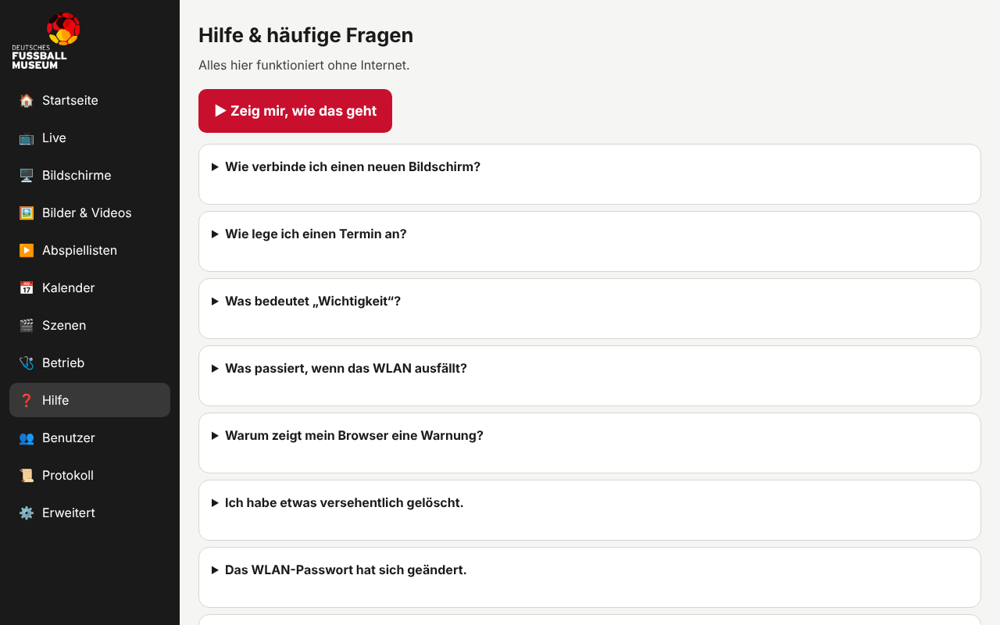

## 12. Für Admins
- **Benutzer & Rollen:** Admin (alles), Redakteur (Inhalte, Termine, Schnellaktionen), Anzeige (nur die Live-Ansicht – für Kasse, Info, Aufsicht). Der letzte Admin kann nicht gelöscht oder herabgestuft werden. Passwort vergessen? Ein Admin setzt es zurück (Benutzer → Passwort zurücksetzen) oder du nutzt einen Wiederherstellungscode. Passwort mindestens 12 Zeichen; optional zusätzliche Sicherheit mit Code aus einer App.
- **Protokoll:** Wer hat wann was getan (nicht veränderbar), Sicherheitsereignisse getrennt filterbar, Export als CSV.
- **Erweitert:** Backup (Passphrase gut aufbewahren – sie wird nirgends gespeichert!), Updates (nur signierte Dateien), Diagnose, Zeitfenster für den Medien-Abgleich.
  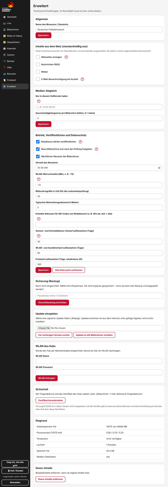

## 13. Wenn etwas nicht klappt
| Problem | Lösung |
|---|---|
| Kein QR-Code am Bildschirm | HDMI-Kabel/Stecker prüfen, 2 Minuten warten. Beim Pi Zero 2 W dauert der Start länger. |
| Handy verbindet sich nicht mit `DFM-Setup-…` | Passwort vom Bildschirm genau abtippen (kleine/große Buchstaben). Notfalls Gerät aus- und einschalten (neues Passwort). |
| Seite öffnet sich nicht von selbst | `http://10.42.0.1/` im Browser eingeben. |
| „Das Passwort scheint falsch zu sein“ | WLAN-Passwort prüfen; Pi 3 B/Zero 2 W brauchen 2,4 GHz. |
| `dfm-signage.local` wird nicht gefunden | Manche Android-Browser kennen `.local` nicht → die IP-Adresse nutzen (Bildschirme → Hub-Adresse). |
| Bildschirm zeigt „Einen Moment bitte“ | Die Uhr ist noch nicht gestellt. Im Hub „Uhr abgleichen“ klicken. |
| Bildschirm läuft nicht mehr | Strom und WLAN prüfen; im Hub „Mit dem Hub neu verbinden“ oder „Neu starten“. |
| Alles schiefgegangen | Bildschirm auf Werkseinstellungen zurücksetzen und neu einrichten; Inhalte liegen im Hub. |

---

# Zusatzfunktionen

## 14. Live: Was läuft gerade?
Im Menü **Live** siehst du alle Bildschirme als Kacheln (1 bis 4 Spalten, auf dem Handy eine). Jede Kachel zeigt Name, Ort, Ampel, das aktuelle Bild, den Namen des Inhalts, „läuft noch 0:23 Min“ und „als Nächstes: … um … Uhr“.
- **Klick auf die Kachel** öffnet die Einzelansicht: großes Bild, **Herkunft** („Termin …“, „Standard-Abspielliste“, „Schnellaktion von Max, bis 15:30“), die nächsten 5 Elemente und Schnellaktionen für genau diesen Bildschirm. Dort gibt es auch **Erkennen**, **Neu laden**, **Testbild** und **Wartungsmodus**.
- **Lesezeichen:** `https://dfm-signage.local/#/live/<Bildschirm>` öffnet direkt einen Bildschirm.
- **Vorschau-Stufen:** Immer sichtbar ist der *Status* (was läuft, wie lange noch). Ein echtes Bild (klein, alle 30 s bzw. 5 s in der Einzelansicht) gibt es nur, solange jemand zuschaut – 60 Sekunden nach dem Schließen hört das auf. Bei schwachen Geräten (Lite), hoher Temperatur oder knappem Speicher bleibt es beim Status („Vorschau vereinfacht, damit der Bildschirm flüssig bleibt“). Bilder liegen nur im Arbeitsspeicher des Hubs; es gibt keine Aufzeichnung. Nur Admins können bewusst ein Bild speichern.
- **Warnhinweise** stehen in Klartext an der Kachel („Offline seit 12 Minuten, zeigt den zwischengespeicherten Inhalt“, „Laut Plan sollte jetzt ‚Eröffnung‘ laufen, der Bildschirm zeigt aber ‚Standard‘“). Offline-Bildschirme erscheinen grau mit „zuletzt gesehen vor …“.
- **Wandmodus** (Monitor im Technikraum): Admins erzeugen unter *Benutzer → Wandmodus* ein Zugangs-Token, das nur die Live-Ansicht erlaubt. Auf dem Monitor `https://dfm-signage.local/#/wand` öffnen, Token einmal eingeben – die Ansicht bleibt dauerhaft offen.
- **Rolle „Anzeige“:** Nur-Lesen-Zugang für Personal. Pro Konto lassen sich die sichtbaren Bildschirmgruppen einschränken (Benutzer → Rolle ändern).

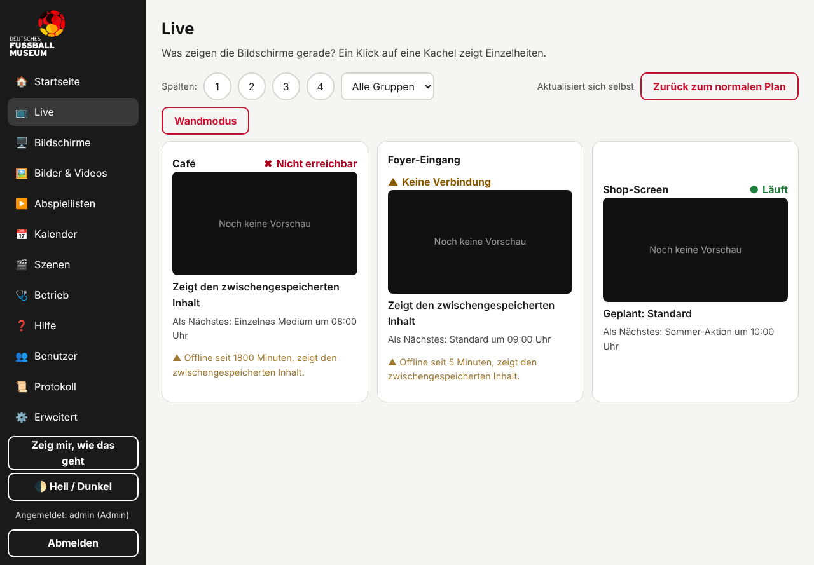

## 15. Schnellaktionen und Szenen
Auf der **Startseite**: *Jetzt auf allen Bildschirmen zeigen* oder *Auf einem Bildschirm zeigen* – für 30 Minuten, 1 oder 2 Stunden oder bis Tagesende. Danach springt der Bildschirm automatisch zum normalen Plan zurück. „Alle Bildschirme“ übersteuert alle Termine und Szenen und fragt vorher nach.
- **Szenen** (Menü *Szenen*) legen für mehrere Bildschirme oder Gruppen fest, was läuft – z. B. „Eröffnung“, „Schulklassen-Tag“. Starten und beenden mit einem Klick.
- Jede Übersteuerung steht mit Ablaufzeit auf der Startseite und im Live-Bereich, im Protokoll (wer, wann, bis wann) und hat den Knopf **Zurück zum normalen Plan**.
- Übersteuerungen wirken auch bei Bildschirmen, die den Hub gerade nicht erreichen, sobald sie wieder verbunden sind – solange die Zeit nicht abgelaufen ist.
- Schnellaktionen sind sofortige Handlungen und laufen **nicht** über den Entwurfsmodus.

## 16. Entwurf und Veröffentlichen
Neue Termine, Abspiellisten und Szenen starten als **Entwurf**. Entwürfe siehst du im Kalender gestrichelt und mit **✎** (nie nur über die Farbe); sie laufen aber **nie** auf einem Bildschirm und erscheinen nicht in der Live-Ansicht.
- **Veröffentlichen** zeigt eine Zusammenfassung („Ab sofort zeigt ‚Shop-Screen‘ am Samstag von 10:00 bis 12:00 Uhr ‚Sommer-Aktion‘.“) und prüft Konflikte und fehlende Medien.
- Änderungen an etwas Veröffentlichtem entstehen als **Entwurfsversion**. Die veröffentlichte Fassung läuft weiter, bis du die neue veröffentlichst – oder den Entwurf verwirfst.
- Startseite: „3 Entwürfe warten auf Veröffentlichung“. Entwürfe älter als 30 Tage werden angemahnt, nicht gelöscht.
- **Frühere Stände** (90 Tage) lassen sich im Termin über „Frühere Stände“ als Entwurf wiederherstellen.
- Admins können unter *Erweitert* festlegen, dass Redakteure nur Entwürfe anlegen dürfen.
- **Duplizieren:** *Kalender → Woche kopieren / Vorlage* kopiert eine ganze Woche in eine andere und speichert **Wochenvorlagen** – immer zunächst als Entwürfe.

## 17. Betrieb: Gesundheit, Wartung, Empfang
Menü **Betrieb**:
- **Gesundheit:** Netzteil zu schwach, Temperatur, SD-Karte, freier Speicher, WLAN – jeweils als Satz in Klartext („Netzteil zu schwach bei ‚Foyer‘. Bitte das Original-Netzteil verwenden“).
- **Profil & Verlauf:** Standort, Etage, Seriennummer, Einbaudatum, Notizen, Link zur Anleitung; Verfügbarkeit (30 Tage) und Ausfallliste.
- **Wartungsmodus:** Der Bildschirm zeigt ein neutrales Bild, Warnungen sind stumm. Vergessen? Nach 24 Stunden erscheint eine Erinnerung.
- **WLAN-Empfang:** Liste mit Signalstufe („Sehr gut / Gut / Schwach / Zu schwach“), Verlauf (24 Stunden / 7 Tage), Wiederverbindungen, Aussetzer, Access Point (Name, Kanal, Band), schlechtester Empfang zuerst. Das ist eine **Übersicht aus den Meldungen der Bildschirme, keine Funkmessung.** Der **Aufstellmodus** zeigt das Signal alle 2 Sekunden (15 Minuten lang) – zum Verschieben des Bildschirms.
- **Wochenbericht:** Ausfälle, Warnungen, Speicherstand – drucken oder als PDF speichern. Die Geräteliste gibt es als Excel/CSV (Bildschirme → *Liste als Excel/CSV*) für die Inventarisierung.
- Ein **nächtlicher Neustart** (Standard 03:30 Uhr) hält die Bildschirme frisch; einstellbar unter *Erweitert*.

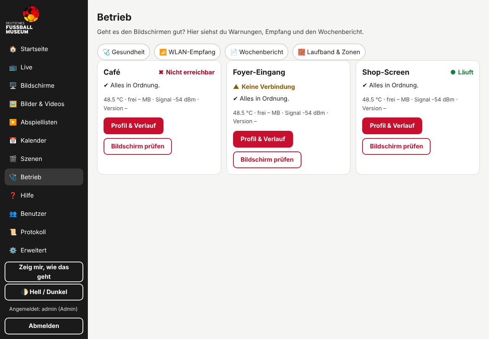

## 18. Bildschirm ersetzen
Bildschirme → **Bildschirm ersetzen**. Neuen Pi einschalten, wie gewohnt mit Code/Startkarte verbinden, in der Liste bestätigen und dabei wählen, welchen alten Bildschirm er ersetzt. Name, Gruppe, Termine und Einstellungen wandern zum neuen Gerät, der alte wird gesperrt (Token ungültig). Einstellungen (Ausrichtung, Ausschaltzeiten, Layout) lassen sich außerdem über *Weitere Aktionen → Einstellungen auf andere kopieren* verteilen.

## 19. Vorlagen und Lesbarkeit
*Bilder & Videos → Vorlage verwenden*: Tagesprogramm, Öffnungszeiten, Führungen, Willkommen für Gruppen, Hinweis/Sperrung, Danke, Countdown, Uhr/Datum. Du füllst nur Felder aus. Der Hub prüft **immer** die Lesbarkeit auf der Auflösung des Ziel-Bildschirms: „Der Text ist für 3 m Abstand zu klein“, „Es ist zu viel Text“, „Der Kontrast ist zu schwach“. Countdown und Datum werden jede Nacht neu berechnet. Eigene Vorlagen und Layoutänderungen sind Admins vorbehalten.

## 20. QR-Code
*Bilder & Videos → QR-Code erstellen*: Adresse, WLAN-Zugang, Kontakt oder Text, mit Überschrift und Kurztext. Der Code entsteht **lokal** im Hub (keine Kurzlinks, kein Tracking), die Adresse steht zusätzlich im Klartext darunter. Der Hub liest den Code zur Gegenprobe selbst wieder aus und warnt bei Abweichung, bei zu kleinen Punkten und beim Betrachtungsabstand. Erlaubt sind nur `http://` und `https://` – `javascript:`, `file:` & Co. werden abgelehnt. Zeigt die Adresse ins interne Netz, warnt der Hub: Besucher erreichen nur öffentliche Adressen. Admins können die erlaubten Adressen für Redakteure einschränken.

## 21. Feiertage, Schließtage, Sondertage
*Kalender → Feiertage & Sondertage*. Die Feiertage Nordrhein-Westfalens sind eingebaut (ohne Internet). Du legst eine Regel für alle Feiertage fest („diese Abspielliste statt der normalen“ oder „Bildschirme aus“) und trägst eigene Tage oder Betriebsferien ein. Ein **aktiver Termin schlägt** einen Sondertag; ein Sondertag **ersetzt** die Standard-Abspielliste. Die Terminvorschau zeigt Sondertage mit an.

## 22. Laufband und Zonen
*Betrieb → Laufband & Zonen*. Layouts mit 2 bis 4 Zonen (Hauptbereich, Laufband, Uhr/Datum, Infospalte) gibt es auf Standard- und Pro-Geräten. **Lite-Geräte zeigen immer den Inhalt im Vollbild.** Laufband-Meldungen haben „gültig von/bis“.

## 23. Bildschirm erkennen, Testbild, Prüfung
- **Erkennen** (Weitere Aktionen): 10 Sekunden lang Name, Ort und Gerätenummer sehr groß.
- **Testbild:** Farben, Raster, Auflösung, Pfeil „OBEN“ (läuft 2 Minuten oder bis zum Beenden).
- **Ausrichtung ändern** hat einen **Rückfall**: ohne Bestätigung innerhalb von 60 Sekunden stellt der Bildschirm die alte Einstellung wieder her.
- **Bildschirm prüfen** (nach dem Verbinden automatisch, jederzeit unter *Betrieb*): Verbindung, WLAN, Uhrzeit, Netzteil/Temperatur/Speicher, Videotest, Bildtest (Ja/Nein-Frage, während der Bildschirm das Testbild zeigt), Ton (falls vorhanden), Synchronisation. Jeder Punkt hat ✔ / ▲ / ✖ mit Handlungshinweis. Das **Protokoll** ist druckbar und bleibt im Geräteprofil. Ein neuer Bildschirm zeigt nur das Standby-Bild, bis die Prüfung bestanden ist oder ein Admin sie bewusst überspringt (wird protokolliert).

## 24. Ordner importieren (Massenimport)
*Bilder & Videos → Ordner / USB-Stick importieren*: Ordner von USB-Stick oder Netzwerkfreigabe (z. B. aus Yodeck) einlesen. Du siehst vorab eine **Vorschau** mit Duplikaterkennung, Namensvorschlägen und Hinweisen je Gerätetyp – **nichts wird übernommen, bevor du bestätigst.** Der Hub liest nur Ordner unter `/media` und `/mnt`.

**USB-Stick (seit Version 0.2.22):** Stecke den Stick **am Hub** ein (nicht an einem reinen Bildschirm). Der Hub bindet ihn **nur lesend** ein (FAT32, exFAT, NTFS oder ext4); Programme auf dem Stick werden nie ausgeführt. Auf der Startseite erscheint „🔌 USB-Stick erkannt“ mit dem Knopf *Inhalte ansehen und übernehmen*. Das öffnet die Vorschau; **übernommen wird erst nach deiner Bestätigung.** Den Stick kannst du jederzeit einfach abziehen, es wird nichts darauf geschrieben. **PDFs** werden dabei seitenweise in Bilder umgewandelt (höchstens 60 Seiten je PDF); ein zweites Einlesen derselben PDF wird als Duplikat erkannt. **Geduld bei großen Sticks:** Für die Duplikaterkennung liest der Hub jede Datei einmal komplett. Bei einem Stick voller Videos kann die Vorschau am Pi 3 einige Minuten brauchen („Ordner wird gelesen …“). Das ist normal, die Seite hängt nicht.

## 25. Datenschutz und Aufbewahrung
Siehe [`datenschutz.md`](datenschutz.md). Unter *Erweitert → Betrieb, Veröffentlichen und Datenschutz* stellst du ein, wie lange Verlaufsdaten und das Protokoll aufbewahrt werden; Altes wird automatisch gelöscht.

## 26. Hochkant und Seitenverhältnisse
*Bildschirme → Bearbeiten → Hochkant und Seitenverhältnis*: Wähle **Einpassen** (ganzes Bild, evtl. schwarze Ränder) oder **Füllen** (füllt alles, der Rand wird abgeschnitten) und einen **Sicherheitsrand** gegen Overscan. Du siehst sofort „So sieht es auf Hochkant aus“ als Vorschau und bekommst Warnungen in Klartext, z. B. „Beim Füllen werden etwa 68 % des Bildes abgeschnitten“ oder „Das Bild füllt nur etwa 32 % des Bildschirms“. Die Ausrichtung selbst stellst du unter *Weitere Aktionen → Ausrichtung* ein (mit 60-Sekunden-Rückfall).

## 27. Gestaffeltes Update
*Erweitert → Gestaffeltes Update*: Das Update (Datei oben einspielen) geht zuerst auf einen **Test-Bildschirm**. Läuft er nach der Beobachtungszeit (Standard 5 Minuten) stabil, folgen die übrigen Bildschirme in **Gruppen** (Standard 2). Schlägt etwas fehl – der Befehl scheitert, der Bildschirm meldet sich nach 15 Minuten nicht wieder –, geht **automatisch jeder schon aktualisierte Bildschirm zur vorherigen Version zurück**. Du kannst jederzeit abbrechen. Alles steht im Protokoll.

## 28. Lizenz und Ablaufdatum bei Medien
*Bilder & Videos → Umbenennen & Lizenz*: Urheber, Lizenz und **Gültig bis**. **14 Tage vorher** erscheint eine Warnung auf der Startseite. Nach dem Ablaufdatum wird das Medium **automatisch nicht mehr gezeigt** – auch auf Bildschirmen, die den Hub gerade nicht erreichen (das Datum steht im Plan des Bildschirms). Die Datei bleibt in der Bibliothek.

## 29. Simulator-Player (für Techniker)
`node tools/simulator.js --hub https://dfm-signage.local --code ABCD-1234 --count 5 --profile standard` startet virtuelle Bildschirme, die sich wie echte anmelden (Code, Fingerabdruck, WSS), den Plan abspielen und in **Live** erscheinen. Jeder Simulator muss im Hub bestätigt werden. Er dient dem Testen von Pairing, Zeitplan, Live-Ansicht und Konflikten ohne echte Pis (siehe `tests/simulator.test.js`). *Er läuft nicht im Browser:* Ein Browser kann beim WebSocket keinen Anmelde-Header senden, und ein zusätzlicher Anmeldeweg würde die Sicherheit des Hubs schwächen.

## 30. Ein Gerät für alles: Hub und Bildschirm in einem
Für den Anfang oder kleine Anlagen braucht es **keinen eigenen Hub-Rechner**. Wähle bei der Einrichtung am Handy unter „Was ist dieses Gerät?“ die Option **„Hub und Bildschirm in einem“**. Du legst wie beim Hub ein Admin-Konto an und gibst dem Bildschirm einen Namen (z. B. „Foyer“).
- Das Gerät speichert alle Inhalte und Termine **und** zeigt selbst Inhalte an. Es erscheint in der Oberfläche als normaler Bildschirm (Hinweis „gleichzeitig der Hub“).
- Weitere Bildschirme verbindest du später ganz normal („Neuen Bildschirm verbinden“).
- Empfohlen ab **Raspberry Pi 4 (2 GB) oder Pi 5**. Auf schwächeren Geräten warnt die Einrichtung.
- Bitte dieses Gerät **nicht** sperren oder entfernen – es ist zugleich die Zentrale. Wird es ausgeschaltet, laufen die anderen Bildschirme mit ihren gespeicherten Inhalten weiter.
- Wächst die Anlage, kann später ein eigener Hub-Rechner dazukommen: Backup auf den neuen Hub zurückspielen, das Kombi-Gerät danach als normalen Bildschirm neu einrichten.

## 31. Videos: am besten Full-HD-MP4
Videos im Format **MP4 (H.264), höchstens Full HD (1920×1080) und 25 oder 30 Bilder pro Sekunde** übernimmt der Hub in wenigen Sekunden – er verpackt sie nur um, ohne sie neu zu berechnen. Das ist besonders wichtig, wenn der Hub ein Raspberry Pi 3 B+ ist. Andere Videos (4K, HEVC/H.265, 50/60 Bilder pro Sekunde, sehr hohe Datenrate) werden neu berechnet; das kann auf einem Pi 3 B+ ein Vielfaches der Videolänge dauern. Die Oberfläche weist darauf hin. Der Ton wird nicht übernommen (die Bildschirme spielen stumm).

## 32. Flüssige Video-Wiedergabe
- Alle Bildschirme nutzen den **Video-Chip des Raspberry Pi** (Hardware-Beschleunigung), den vollen Prozessortakt und genug reservierten Speicher für den Video-Decoder.
- Für einen Bildschirm, der **hauptsächlich Videos** zeigt: *Bildschirme → Bearbeiten → Wiedergabe → „Video-optimiert“*. Videos laufen dann direkt über den Video-Chip ohne Browser dazwischen – das ist auf dem Raspberry Pi 3 B+ am flüssigsten. Texte werden dort als Bild gezeigt, Laufband und Zonen gibt es auf diesem Bildschirm nicht. Der Bildschirm startet die Anzeige nach dem Umstellen einmal neu.
- Videos liegen immer vollständig auf dem Bildschirm, bevor sie gezeigt werden – es wird nie über das WLAN „gestreamt“. Ein schwaches WLAN kann die Wiedergabe deshalb nicht stören.
- Videos am besten als **Full-HD-MP4 (H.264, 25/30 Bilder pro Sekunde)** liefern (siehe Kapitel 31).

## 33. Foto vom Handy direkt zeigen
Auf der Startseite: **📷 Foto vom Handy zeigen**. Am Handy öffnest du dazu die Adresse des Hubs und tippst auf den Knopf (praktisch: Adresse mit `/#/foto` am Ende als Lesezeichen oder auf dem Startbildschirm ablegen, dann öffnet sich das Fenster sofort). Foto aufnehmen oder aus der Galerie wählen, **Wo zeigen** (alle Bildschirme oder einen) und **Wie lange** (15 Minuten bis Tagesende) einstellen, *Hochladen und zeigen*. Das Foto übersteuert den Plan und der Bildschirm springt danach von selbst zum normalen Plan zurück. Es bleibt im Ordner „Handy-Fotos“ unter *Bilder & Videos*. Mit **🧹 Aufräumen** (Kapitel 34) wirfst du es später weg. Erlaubt sind JPG, PNG und WebP; bei einem iPhone, das „Format nicht unterstützt“ meldet, stellst du in den Kamera-Einstellungen *Formate → Kompatibelste* ein.

## 34. Aufräumen: Was wird nirgends mehr benutzt?
*Bilder & Videos → 🧹 Aufräumen* listet alle Bilder, Videos und Folien, die in **keiner Abspielliste, keinem Termin, keiner laufenden Übersteuerung, keinem Sondertag, keiner Szene und keiner App** mehr vorkommen. Du siehst Alter, Größe und ob das Ablaufdatum überschritten ist. Vorausgewählt sind nur Dateien, die älter als ein Tag sind (Frisches legst du vielleicht gleich noch in eine Liste). **Löschen** schiebt in den Papierkorb, dort sind sie 30 Tage zurückholbar. Zugriff wie beim Löschen von Medien (Redakteur und Admin).

## 35. Frage & Antwort
*Bilder & Videos → ❓ Frage & Antwort*: Du gibst eine Frage und eine Antwort ein, es entstehen **zwei Folien** im Ordner „Quiz“ (Frage blau mit „?“, Antwort grün). Lege beide in einer Abspielliste hintereinander, zum Beispiel Frage 20 Sekunden, Antwort 10 Sekunden. Geeignet für Schulklassen, Ferienprogramm und Quiz-Tage.

## 36. Wie lange läuft eine Abspielliste?
Unter *Abspiellisten* steht bei jeder Liste „Eine Runde dauert 2:00 Minuten“ (Bilder und Texte zählen mit der eingestellten Zeit, Videos mit ihrer echten Länge). Beim Planen eines **Termins** warnt der Hub vor dem Veröffentlichen, wenn der Termin **kürzer als eine Runde** ist: die Liste würde dann nicht einmal ganz durchlaufen.

## 37. App „An diesem Tag“
*Apps → An diesem Tag* zeigt täglich einen Eintrag aus **eurer eigenen Liste** („An diesem Tag in der Fußballgeschichte“). Ein Eintrag pro Zeile: `04.07.1954 Text` (das Jahr ist optional: `24.12. Text`). Gibt es für heute nichts, erscheint der nächste Eintrag. Die mitgelieferten Beispiele bitte **prüfen und ergänzen**. Braucht kein Internet. Mehr zu Apps in [`apps.md`](apps.md).

## 38. Notfall-Meldung mit einem Klick
Auf der Startseite: **🚨 Notfall-Meldung**. Du wählst einen fertigen Text (zum Beispiel „Bitte das Gebäude verlassen“, „Technische Störung“, „Heute geschlossen“) oder schreibst einen eigenen, wählst die Dauer und bestätigst. Die Meldung erscheint **sofort auf allen Bildschirmen** in großer weißer Schrift auf rotem Grund und ersetzt alles andere: auch Szenen, Schnellaktionen und geteilte Bildschirme. Beendet wird sie über den Hinweis auf der Startseite („Meldung jetzt beenden“) oder nach der eingestellten Zeit.
- **Wichtig:** Das ist eine Durchsage am Bildschirm, **keine Alarmanlage** und kein Ersatz für Lautsprecher oder Brandschutz-Technik. Bildschirme, die nachts per Zeitschaltung ausgeschaltet sind, bleiben aus.
- Die **Beispieltexte** sind nur Vorschläge. Admins ändern sie unter „Texte ändern“ (bis zu 6 Texte); bitte mit der Leitung und dem Brandschutz abstimmen.
- Redakteure und Admins dürfen auslösen. Jede Meldung steht im Protokoll (mit Name und Zeit).

## 39. Update per USB-Stick
Kopiere die Update-Datei (`dfm-signage-update-….dfmpkg`) auf einen USB-Stick und stecke ihn **am Hub** ein. Auf der Startseite erscheint „📦 Update auf dem USB-Stick“ mit der Version und dem Hinweis „Signatur ✔“. Mit **Installieren** und einer Rückfrage wird es eingespielt; der Hub startet danach kurz neu. Die Bildschirme laden das Update danach auf Wunsch (*Erweitert → Update einspielen → Alle Bildschirme laden das Update*). Unter *Erweitert → Update einspielen* siehst du auch Pakete, die nicht verwendet werden können, mit dem Grund (zum Beispiel falsche Signatur).
- Ohne **gültige Signatur** wird nichts installiert. Ein älteres Paket wird mit deutlichem Hinweis angeboten („ÄLTER als die installierte Version“).
- Ein Update ändert das **Programm**, nicht das Betriebssystem. Neue Systemdateien (zum Beispiel die USB-Erkennung selbst) kommen nur mit einem neuen SD-Karten-Image.
- **Der feste Schlüssel ist seit dem 09.10.2026 angelegt.** Jeder Bau auf GitHub erzeugt jetzt zusätzlich ein Update-Paket (`dfm-signage-update-….dfmpkg`, unter „Releases“). Es gilt für alle Geräte, die mit einem Image **ab Version 0.2.23 (nach dem Anlegen des Schlüssels)** eingerichtet wurden; ältere Images haben einen anderen Schlüssel und lassen sich nur per neuem Image aktualisieren. Der **private Schlüssel** liegt als Sicherungskopie im Ordner `Dokumente\DFM-Schluessel` auf dem Rechner der Betreuung und als Geheimnis `DFM_SIGN_KEY` auf GitHub. Bitte eine Kopie in den Passwortsafe legen und nie weitergeben; geht er verloren, lassen sich bereits verteilte Geräte nicht mehr per Paket aktualisieren (siehe `LIES-MICH.txt` im Ordner).

## 40. Meldung bei Ausfall (E-Mail) und Statusadresse
*Erweitert → Meldung bei Ausfall*: Du trägst den **Mailserver des Museums** ein (Adresse, Port, Verschlüsselung, Absender und bis zu 5 Empfänger). Fällt ein Bildschirm länger aus (einstellbar, mindestens 5 Minuten), schickt der Hub **eine E-Mail**, bei mehreren gleichzeitig **eine gemeinsame**. Auf Wunsch meldet er auch, wenn der Bildschirm wieder da ist. Mit **Speichern und Test-E-Mail senden** prüfst du alles sofort.
- Bildschirme in **Wartung** und noch nie gesehene Geräte lösen keine Mail aus. Mit der **Ruhezeit** (zum Beispiel 22:00 bis 07:00) gehen nachts keine Mails raus; sie werden nach der Ruhezeit nachgeholt.
- Gegen Mail-Fluten: Eine Verbindung, die ständig wackelt, löst höchstens alle 30 Minuten eine Ausfall-Mail aus. Ist der Mailserver kaputt, versucht der Hub es alle 5 Minuten neu.
- Das Passwort des Mailservers wird **verschlüsselt** gespeichert und nie angezeigt. Anmeldung ohne Verschlüsselung ist nicht möglich. „Zertifikat nicht prüfen“ nur nutzen, wenn die IT das Zertifikat nicht ändern kann.
- **Fällt der Hub selbst aus, kann er nichts melden.** Dafür gibt es die **Statusadresse für die IT-Überwachung**: *Zugang für die Überwachung erzeugen* zeigt Adresse und Zugangs-Token (nur einmal). Nagios, Zabbix oder Uptime Kuma fragen `https://dfm-signage.local/api/v1/status` mit dem Header `X-Live-Token` ab: **200 = alles in Ordnung, 503 = Ausfall** (`?strict=1` meldet auch „keine Verbindung“, `?format=text` liefert Klartext). Das Token erlaubt nur Lesen und lässt sich unter „Benutzer → Wandmodus“ widerrufen.

## 41. Hub ersetzen (Assistent)
Im Menü **🛟 Hub ersetzen** (nur Admins): Der **Vorsorge-Check** zeigt, ob das Backup eingerichtet und frisch ist und ob schon eine Kopie auf einem anderen Rechner liegt (Backup herunterladen und auf einem anderen Rechner oder Netzlaufwerk ablegen, etwa einmal im Monat). Die **Einrichtungsdatei** `dfm-setup.txt` für den Ersatz-Hub entsteht nur in deinem Browser (Passphrase und WLAN-Passwort werden nirgends gespeichert). Die **Notfallkarte** (Drucken) enthält Adresse, MAC, Fingerabdruck und die Schritte, damit sie auch bei Ausfall des Hubs zur Hand ist.
- **Mediendateien sind nicht im Backup.** Nach einem Hub-Wechsel erscheinen Bilder und Videos ohne Vorschau, bis du die Originale wieder hochlädst oder per USB-Stick importierst. Die Bildschirme zeigen bis dahin ihre gespeicherten Inhalte.
- Das Vorgehen ist noch **nicht auf echter Hardware durchgespielt**: bitte einmal in Ruhe üben.

## 42. Wiedergabe-Nachweis
*Betrieb → 🎞️ Wiedergabe*: Zeigt, wie oft und wie lange jedes Bild, Video und jede Folie auf den Bildschirmen lief, nach Medium, Bildschirm oder Tag, für frei wählbare Zeiträume (Letzte 7/30 Tage, Dieser/Letzter Monat). **CSV für Excel** exportiert die Einzelwerte (Datum, Bildschirm, Medium, Einblendungen, Minuten); das ist zum Beispiel für Sponsoren-Nachweise gedacht.
- Gezählt wird jede **Einblendung** auf einem Bildschirm. Nachts ausgeschaltete Bildschirme zählen nicht. Die Zahlen können bei Stromausfall um wenige Minuten abweichen; Bildschirme ohne Verbindung melden nach.
- Es werden **nur Zähler** gespeichert, keine Besucherdaten. Aufbewahrung 400 Tage. Konten mit Gruppen-Beschränkung sehen nur ihre Bildschirme.
- Mitgezählt wird erst ab Version 0.2.23.

## 43. Laufband und Uhr auf „Video-optimiert“-Bildschirmen
Bildschirme mit der Wiedergabe-Art „Video-optimiert“ (mpv) zeigen jetzt auch **Laufband, Uhr und Infozone**, wenn ihnen ein Zonen-Layout zugewiesen ist (*Betrieb → Laufband & Zonen*). Unterschiede zum Browser: Das Laufband **scrollt nicht**, sondern zeigt die Meldungen im Wechsel (alle 6 Sekunden, lange Meldungen in Teilen). Bei **gedrehten** Bildschirmen und auf Geräten mit dem Profil „Lite“ (Zero 2 W) gibt es kein Laufband (immer Vollbild). Auf den Hinweisbildern (Warten, Uhrzeit) und während des Teilens wird es ausgeblendet.

## 44. Bildschirm teilen
Auf der Startseite: **🖥️ Bildschirm teilen**. Du überträgst deinen PC-Bildschirm (ganz, ein Fenster oder ein Browser-Tab) live auf ausgewählte Museumsbildschirme, zum Beispiel für eine Präsentation. Der Plan pausiert dort, bis du **⏹ Beenden** drückst (roter Balken am unteren Rand), die Zeit abläuft (30 Minuten bis 4 Stunden) oder eine Notfall-Meldung startet.
- Geht nur am PC mit **Google Chrome oder Microsoft Edge** und mit der Verwaltung über **https**. Die Verwaltungsseite muss geöffnet bleiben; ein Tab im Hintergrund ist in Ordnung.
- Alles bleibt im Haus (Browser → Hub → Bildschirm). Ton wird nicht übertragen; es entsteht eine Verzögerung von etwa einer halben bis ganzen Sekunde.
- **Browser-Bildschirme** zeigen etwa 5 Bilder pro Sekunde (flüssig genug für Folien und einfache Bewegung). Bildschirme mit **„Video-optimiert“** zeigen eine einfache Darstellung mit etwa **1 Bild pro Sekunde** (gut für Folien, nicht für Videos).
- Pro Person läuft eine Übertragung, ein Bildschirm kann immer nur von einer Person geteilt werden. Andere sehen auf der Startseite, wer gerade teilt; Admins können fremde Übertragungen beenden.
- Dies ist **kein Ersatz für Miracast/AirPlay**: Geräte wie Handys und Tablets können so nicht direkt senden.

## 45. Live-Spielstand und Tor-Jubel
*Apps → 🏟️ Live-Spiel & Tor-Jubel* (nur Admins): Du gibst Liga und **Verein** ein (ein Teil des Namens genügt, zum Beispiel „Dortmund“). Der Hub holt die Daten von **OpenLigaDB** (kostenlos, von Fans gepflegt) und pflegt **eine Folie „App: Live-Spiel & Tor-Jubel“**, die du in eine Abspielliste legst:
- **Vor dem Spiel:** „Nächstes Spiel … Anstoß in 25 Min.“ · **Während des Spiels:** „BVB 2:1 FCB“, die ungefähre Spielminute und die letzten Tore · **Danach:** „Endstand“.
- **Tor-Jubel** (ein Haken, standardmäßig an): Fällt ein **neues Tor deines Vereins**, zeigen die Bildschirme **20 Sekunden lang** (einstellbar von 5 bis 60) ein grünes „TOR!“ und kehren dann **von selbst** zum normalen Plan zurück. Mit **Wo zeigen?** wählst du „Alle Bildschirme“ oder nur eine Gruppe (zum Beispiel das Foyer – dann stört der Jubel keine Büros oder Tagungsräume). **🎉 Tor-Jubel testen** zeigt die Folie sofort, ohne dass ein Tor gefallen sein muss.
- Der Jubel unterbricht Hand-Aktionen (zum Beispiel ein gezeigtes Foto oder eine Präsentation) und Regeln, aber **nie eine Notfall-Meldung** und nicht, während ein Bildschirm geteilt wird. Gegentore, schon gespielte Tore (zum Beispiel nach einem Neustart des Hubs mitten im Spiel) und ein zweites Tor innerhalb von 30 Sekunden lösen keinen Jubel aus.
- Rund um das Spiel fragt der Hub **jede Minute** nach, sonst nur alle 5 bis 15 Minuten (das schont die kostenlose Datenquelle).
- **Grenzen, bitte beachten:** OpenLigaDB wird von Menschen gepflegt. Ein Tor erscheint dort oft erst **nach ein bis zwei Minuten**; manchmal gibt es Fehler oder Korrekturen. Das ist **keine Torlinientechnik** – der Jubel kommt also mit Verzögerung. Die Spielminute ist **geschätzt** (aus der Anstoßzeit), die Quelle liefert sie nicht. Fällt die Quelle aus, bleibt die letzte Folie stehen und die App zeigt einen Fehler.
- Ob der Jubel mit echten Live-Daten richtig auslöst, ist **noch nicht an einem echten Spieltag geprüft** (Tests mit Beispieldaten sind grün).

## 46. Wenn-Dann-Regeln
Im Menü **🤖 Regeln** legst du fest, was die Bildschirme **automatisch** zeigen: „Wenn es regnet, zeige die Liste mit Indoor-Tipps“, „Solange das Spiel läuft, zeige die Folie Live-Spiel“, „Samstag und Sonntag zeige das Wochenendprogramm“. Wähle oben eine **Vorlage** (Bei Regen, Solange das Spiel läuft, Am Spieltag, Bei Hitze, Am Wochenende) oder **＋ Eigene Regel**.
- Eine Regel hat bis zu **vier Bedingungen** (alle müssen zugleich zutreffen): **Wetter** (regnet / regnet bald / trocken / mehr oder weniger als … °C – Daten des Deutschen Wetterdienstes, die App „Wetter“ muss an sein), **Fußballspiel** (läuft / heute ist Spieltag / beginnt in höchstens … Minuten / läuft nicht – App „Live-Spiel“ muss an sein) und **Uhrzeit/Wochentag**.
- Dazu den **Inhalt** (eine veröffentlichte Abspielliste oder ein einzelnes Bild/Video/Folie) und **wo** (alle Bildschirme, eine Gruppe oder ein Bildschirm). **🔍 Jetzt prüfen** zeigt vor dem Speichern, ob die Bedingung gerade zutrifft.
- Unter **Weitere Einstellungen**: **Wichtigkeit** (1 bis 9; gelten zwei Regeln für denselben Bildschirm, gewinnt die wichtigere) und **Wartezeit** (die Bedingung muss so lange durchgehend gelten, bevor die Regel startet – gegen kurze Schauer).
- Jede Karte zeigt, **was gerade los ist**: ✔ zeigt gerade · ⏳ startet gleich · ⏸ pausiert · ↓ verdrängt (eine wichtigere Regel zeigt gerade ihren Inhalt) · ▲ Daten fehlen · ✖ Fehler (zum Beispiel Inhalt gelöscht).
- **Rangfolge:** Notfall-Meldung → Tor-Jubel → Hand-Aktionen (Schnellaktionen, Szenen, Foto vom Handy, Präsentation) → Regeln → normaler Plan. Eine Regel überstimmt also nie etwas, das jemand von Hand gestartet hat.
- **Beenden von Hand:** Beendest du die Anzeige einer Regel (Startseite → „Zurück zum normalen Plan“), **pausiert** die Regel, bis ihre Bedingung einmal nicht mehr gilt. Mit **▶ Jetzt wieder starten** geht es sofort weiter.
- **Nachlauf:** Eine Regel mit Wetter oder Spiel endet erst, wenn die Bedingung **2 Minuten lang** nicht mehr gilt (ein kurzer Wetterwechsel lässt sie nicht flackern). Eine reine Uhrzeit-Regel endet auf die Minute genau.
- **Sicherheitsnetz:** Der Hub verlängert die Anzeige einer Regel immer nur um etwa 15 Minuten. Fällt der Hub aus, **endet die Regel von selbst** und die Bildschirme zeigen wieder ihren Plan. Fehlen die Wetter- oder Spieldaten (älter als 2 bzw. 3 Stunden), gilt die Bedingung als „unbekannt“ und löst nicht aus.
- Der Inhalt einer eingeschalteten Regel wird vorab auf die Bildschirme geladen, damit der Wechsel sofort geht. Redakteure und Admins dürfen Regeln anlegen; jede Änderung steht im Protokoll. Konten, die auf bestimmte Gruppen beschränkt sind, dürfen Regeln nur für ihre eigenen Gruppen und Bildschirme anlegen, ändern oder löschen (nicht für „alle Bildschirme“).

## 47. „Als Nächstes“ – Countdown je Raum
*Apps → ⏱️ Nächster Programmpunkt* (nur Admins): Aus eurem **Event-Kalender** entsteht eine Folie „Läuft gerade (noch 30 Min.)“ / „Als Nächstes in 20 Min.: 11:00 Uhr Führung …“ / „Danach: …“. Lässt du das Feld **Adresse** leer, wird die Adresse des Tagesprogramms mitbenutzt.
- Trägst du unter **Räume** Namen ein (ein Raum pro Zeile, zum Beispiel „Foyer“ und „Saal A“), gibt es **für jeden Raum eine eigene Folie** („App: Nächster Programmpunkt – Foyer“). Sie zeigt nur Termine, bei denen das Feld **Ort** im Kalender den Raumnamen enthält. So zeigt jeder Bildschirm sein eigenes Programm: Lege die passende Folie in die Abspielliste des Bildschirms.
- Der Hub rechnet **jede Minute** neu, holt den Kalender aber höchstens **alle 5 Minuten**. Die Zeitangabe wird grob gerundet („in 20 Min.“), damit sich die Folie nicht jede Minute ändert (jede Änderung wird an alle Bildschirme verteilt). Ganztägige und abgesagte Termine werden nicht gezeigt; ist heute nichts mehr, erscheint der erste Termin von morgen.
- Wird ein Raum aus der Liste gestrichen, sagt seine Folie „Dieser Eintrag ist nicht mehr eingerichtet“ – entferne sie dann aus den Abspiellisten.
- Die Bildschirme zeigen die Folie, wie sie beim letzten Abruf war. Fällt der Hub aus, bleibt der **Countdown stehen** (er zeigt dann veraltete Zeiten) – wie bei allen Apps.

## 48. Prognose: Wann wird es eng?
*Betrieb → 🔮 Prognose* (und als Hinweis auf der Startseite, wenn etwas auffällt): Der Hub schätzt aus dem Verlauf der letzten Tage, **wann der Speicherplatz voll wird** („Bei gleichem Tempo ist er in etwa 3 Wochen voll“), ob der **freie Arbeitsspeicher stetig sinkt** (Hinweis auf ein Speicherleck, „wird in etwa 9 Stunden knapp“) und ob ein Gerät **oft zu heiß** wird oder immer wärmer.
- Es sind **Schätzungen** (eine gerade Linie durch die Stundenmittelwerte der letzten 7 Tage). Sie brauchen **mindestens 24 Stunden** Messwerte und werden mit jedem Tag genauer. Ein großes Video, das morgen hochgeladen wird, sieht die Schätzung nicht voraus. Ist der Verlauf zu unregelmäßig, sagt der Hub das ehrlich und schätzt nichts.
- Ampel: ✔ in Ordnung · ▲ Hinweis zum Vorbeugen (Speicher in unter 30 Tagen voll, Gerät oft über 60 °C) · ✖ dringend (unter 14 Tagen, Arbeitsspeicher in unter 12 Stunden knapp, oft über 70 °C).
- Der **freie Speicherplatz** der Bildschirme wird erst ab Version 0.2.24 mitgeschrieben; bis dahin steht dort „noch keine Werte“.

## 49. Bild-Wächter: erkennt schwarze und eingefrorene Bildschirme
*Betrieb → 🩺 Gesundheit*: Ein Bildschirm kann „online“ sein und trotzdem nur Schwarz zeigen oder stehen geblieben sein. Der Hub fragt deshalb **etwa alle 10 Minuten** ein Bild ab (wie die Live-Ansicht) und prüft drei Dinge:
- **Bild ist schwarz:** zwei Proben hintereinander (also nach etwa 15 bis 20 Minuten), obwohl es Inhalt geben müsste. Das Standby-Bild mit dem Logo zählt nicht als schwarz.
- **Bild steht still:** Die Liste müsste wechseln, das Bild bleibt aber gleich. Damit es **keine Fehlalarme** gibt, rechnet der Hub je Liste aus, wie viele gleiche Proben praktisch nur bei einem eingefrorenen Bild vorkommen. Das dauert je nach Liste **ein bis vier Stunden**. Bei einer Liste mit nur einem Bild, mit sehr ungleich langen Elementen oder mit Uhr im Bild meldet er das gar nicht.
- **Wiedergabe steht:** Der Bildschirm meldet seit über 15 Minuten keinen Wechsel mehr (länger bei langen Videos). Das braucht kein Bild und gilt auch für Lite-Bildschirme.
- Die Meldung erscheint unter *Betrieb → Gesundheit* und auf der Startseite („… zeigt seit etwa 26 Minuten nur Schwarz“). Oft hilft **Neu laden** (Menü „Weitere Aktionen“ am Bildschirm). Die Zeile „🔍 Bild-Wächter“ auf jeder Karte zeigt, wann zuletzt geprüft wurde.
- **Es werden keine Bilder gespeichert**, nur eine Prüfsumme und die Helligkeit des verkleinerten Bildes. Admins können den Wächter mit dem Haken oben ausschalten.
- **Grenzen, bitte beachten:** Der Wächter prüft das Bild, das der **Pi** erzeugt – nicht das, was der **Fernseher** zeigt. Ein ausgeschalteter Fernseher oder ein loses HDMI-Kabel bleiben unbemerkt. Lite-Bildschirme und stark ausgelastete Geräte liefern keine Bildproben. Im Wartungsmodus, bei „Anzeige aus“ und an Schließtagen ist der Wächter still. Er ist **noch nicht auf echter Hardware geprüft**.

## 50. Pflege-Erinnerungen
*Betrieb → 🧰 Pflege*: Ein Raspberry Pi im Dauerbetrieb braucht ab und zu Zuwendung. Der Hub erinnert an drei Aufgaben: **Kühlkörper, Gehäuse und Lüftung reinigen** (alle 12 Monate), **Netzteil und Kabel prüfen** (alle 12 Monate) und **SD-Karte tauschen** (alle 24 Monate).
- Jede Aufgabe zeigt die Bildschirme, **fällige zuerst**. Mit **✔ Erledigt** (nur Admins) trägst du ein, dass es gemacht wurde (heute oder ein früherer Tag); „Alle fälligen abhaken“ erledigt mehrere auf einmal.
- Als Ausgangspunkt gilt, was zuletzt eingetragen wurde, sonst das **Einbaudatum** (Bildschirm bearbeiten), sonst der Tag, an dem der Bildschirm verbunden wurde.
- Fällige Aufgaben erscheinen auf der **Startseite**, eine Zeile je Aufgabe mit den betroffenen Bildschirmen.
- Admins können die Abstände (1 bis 60 Monate) ändern und Aufgaben ausschalten („Abstände ändern“).
- Das ist eine **Erinnerung, keine Messung**: Der Hub weiß nicht, ob wirklich geputzt wurde.

## 51. Einschübe (Menü 📌 Einschübe)
Eine Folie erscheint regelmäßig zwischendurch, zum Beispiel **„alle 5 Minuten das Sponsor-Logo für 10 Sekunden“**, ohne dass du sie in jede Abspielliste einzeln einbauen musst.
- Du wählst ein Bild, Video oder eine Folie, den **Abstand** (1 bis 240 Minuten), die **Dauer** (3 bis 120 Sekunden), **wo** (alle Bildschirme, eine Gruppe oder ein Bildschirm) und auf Wunsch einen **Zeitraum**. Ein Einschub darf höchstens die **Hälfte der Zeit** belegen.
- Der Bildschirm schiebt ihn **zwischen zwei Elementen** ein und setzt die Liste danach an der unterbrochenen Stelle fort. Der Abstand ist daher ungefähr (ein Video läuft immer zu Ende). Das **funktioniert auch ohne Hub**, und jede Einblendung zählt im Wiedergabe-Nachweis mit.
- **Nicht** erscheint er während einer Notfall-Meldung, eines Tor-Jubels, einer Hand-Aktion (zum Beispiel Präsentation), in der Wartung und an Schließtagen. Der erste Einschub kommt nach einer vollen Wartezeit.
- **Nur Bildschirme ab Version 0.2.26** zeigen Einschübe (ältere würden den Plan ablehnen). Die Karte sagt, bei wie vielen Bildschirmen das noch aussteht.
- Redakteure und Admins dürfen Einschübe anlegen (höchstens 20); Konten mit Gruppen-Beschränkung nur für ihre eigenen Gruppen und Bildschirme.

## 52. Etiketten für die Bildschirme drucken
*Bildschirme → 🏷️ Etiketten drucken* (nur Admins): Für jeden Pi ein Aufkleber mit **Name, Gruppe, kurzer Nummer** (dieselbe Nummer erscheint bei „Diesen Bildschirm erkennen“) und einem **QR-Code**. Scannt die Haustechnik ihn mit dem Handy, öffnet sich die **Live-Ansicht dieses Bildschirms** (nach der Anmeldung).
- Du wählst die Bildschirme und die Größe (21 Etiketten je A4-Seite oder 8 große). Eine eigene Zeile, zum Beispiel „Störung? Haustechnik Tel. 123“, wird auf jedem Etikett gedruckt und in diesem Browser gemerkt. Gedruckt wird mit dem Druckknopf oder Strg+P.
- Der QR-Code enthält die **Adresse, unter der du die Verwaltung gerade geöffnet hast**. Bekommt der Hub später eine andere Adresse, müssen die Etiketten neu gedruckt werden.
- Auf Etikettenbögen müssen eventuell die Seitenränder im Druckdialog angepasst werden. Auf normalem Papier ausdrucken und ausschneiden geht immer.

## 53. Neues Aussehen und die Anleitung im Programm (seit 0.2.27)
- **Neues Aussehen:** Die Seitenleiste ist in Bereiche gegliedert (**Inhalte, Planen, Bildschirme, Betrieb, Verwaltung**), die Startseite zeigt Kacheln mit Symbolen und Bildschirm-Karten mit Vorschau, Zustände erscheinen als farbige Plaketten (immer mit Symbol **und** Text), Fenster und Knöpfe sind weicher gestaltet. Die Anmeldeseite hat eine Markenfläche. Alles funktioniert im hellen und im dunklen Design (Knopf „🌓 Hell / Dunkel“ unten links) und am Handy (die Navigation wird dort zu einer wischbaren Leiste). Viele Hinweise auf der Startseite werden zusammengeklappt („Weitere 3 Hinweise anzeigen“).
- **Anleitung** (Menü ❓ **Hilfe**): über **40 Kapitel** in einfacher Sprache, sortiert nach *Erste Schritte, Inhalte, Abspielen planen, Automatik & Apps, Betrieb & Pflege, Verwaltung, Probleme lösen*. Jedes Kapitel hat nummerierte **Schritte**, 💡 Tipps, ⚠️ Warnungen und Knöpfe, die direkt zur passenden Seite führen. Oben suchst du nach einem **Stichwort** (Umlaute egal: „einschub“ findet „Einschübe“) oder filterst nach Thema.
- **„Anleitung zu dieser Seite“:** Unter der Überschrift jeder Seite führt ein Link zum passenden Kapitel (Adresse zum Beispiel `https://dfm-signage.local/#/hilfe/regeln` – praktisch als Lesezeichen oder zum Weitergeben).
- **Rundgang „Zeig mir, wie das geht“:** zehn Stationen durch die Seitenleiste; Bereiche, die es für dein Konto nicht gibt, werden übersprungen.
- Die Anleitung steht im Programm selbst und braucht kein Internet. Texte und Zahlen darin werden bei jeder Programmänderung gegen den Programmcode geprüft (zum Beispiel die Pflege-Abstände).

## 54. Neu in 0.2.29: Listen ineinander, Auslöser-Links, Fluchtweg-Pläne, Live-Bild, Gleichtakt und Videowand
- **Listen ineinander einfügen** (*Abspiellisten → Bearbeiten → „Andere Abspielliste einfügen“*): Eine Hauptliste besteht aus Teillisten, zum Beispiel „Ausstellung A“ und „Café“. Ändert sich eine Teilliste, ändert sich die Hauptliste mit. Höchstens 3 Ebenen tief; eine Liste darf sich nicht selbst enthalten; eingefügt werden nur **veröffentlichte** Listen. Soll eine Teilliste gelöscht werden, die woanders eingefügt ist, fragt der Hub vorher nach.
- **Auslöser-Links** (*Szenen → ganz unten, nur Admins*): Ein geheimer Link startet oder beendet eine Szene von außen – zum Beispiel per Handy-Kurzbefehl, Taste am Empfang oder aus der Haustechnik. Der Link wird **nur einmal** angezeigt; wer ihn kennt, kann die Szene auslösen. Jeder Aufruf steht im Protokoll, falsche Links werden gebremst, eine laufende Notfall-Meldung wird **nie** beendet. Aufgerufen wird per **POST**; einfaches Aufrufen (GET) ist nur erlaubt, wenn du es für einen Auslöser einschaltest. Der Hub hat ein selbst erstelltes Zertifikat, das aufrufende Geräte einmal bestätigen müssen.
- **Fluchtweg-Plan je Bildschirm** (*Bildschirme → Bearbeiten → „Fluchtweg-Plan“*): Bei einer Notfall-Meldung zeigt der Bildschirm nach dem Meldungstext (10 s) seinen Plan (15 s), im Wechsel. Der Plan liegt immer schon auf dem Bildschirm. Bildschirme ohne Plan zeigen nur die Meldung. **Nur den vom Brandschutz freigegebenen Plan verwenden;** das ist eine Anzeige und ersetzt keine Beschilderung.
- **Live-Bild** (*Bilder & Videos → 📹 Live-Bild (Kamera)*): Ein Kamerabild oder Stream aus dem **Museumsnetz** als Folie (rtsp, http, https, udp). Läuft nur auf Bildschirmen mit **„Video-optimiert“**; andere überspringen es. Fällt die Kamera aus, erscheint die Ersatzfolie und es wird nach einigen Sekunden erneut versucht. Benutzer und Passwort in der Adresse werden nie angezeigt, aber an die Bildschirme gesendet – bitte ein Konto nur mit Leserechten.
- **Gleichtakt und Videowand** (*Bildschirme → Gruppen → „Gleichtakt / Videowand“*): **Gleichtakt** – alle Bildschirme einer Gruppe wechseln zur selben Zeit und starten Videos gemeinsam. **Videowand** – ein Bild verteilt sich auf ein Raster (bis 4 × 4); jeder Bildschirm zeigt seinen Teil, den Platz stellst du bei „Bearbeiten“ ein. Die Bildschirme wechseln dafür automatisch auf „Video-optimiert“. Notfall-Meldungen erscheinen immer ganz. Einschübe, Laufband und Uhr entfallen. **Eine Videowand mit Full-HD-Video ist für den Raspberry Pi 3 B+ anspruchsvoll – bitte erst mit zwei Bildschirmen ausprobieren.**
